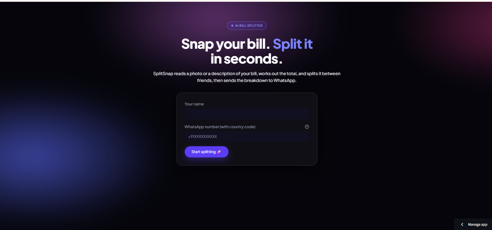
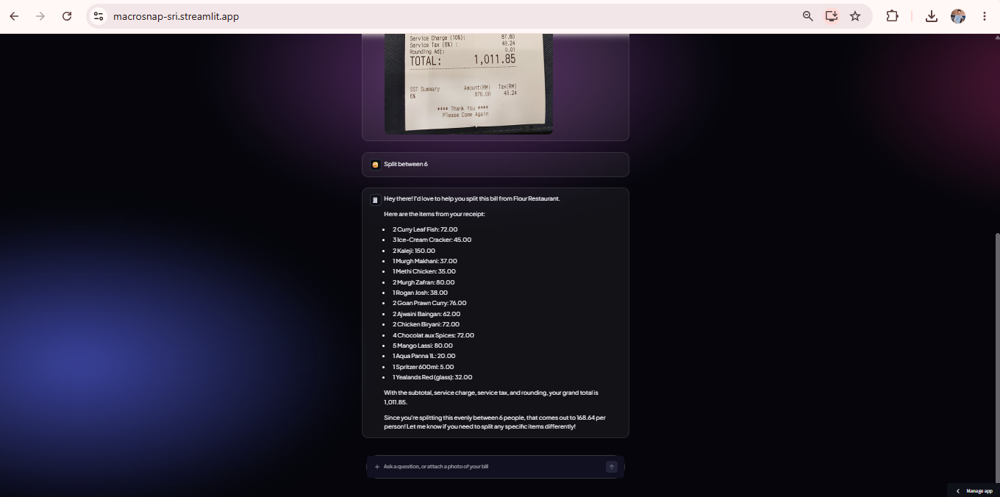
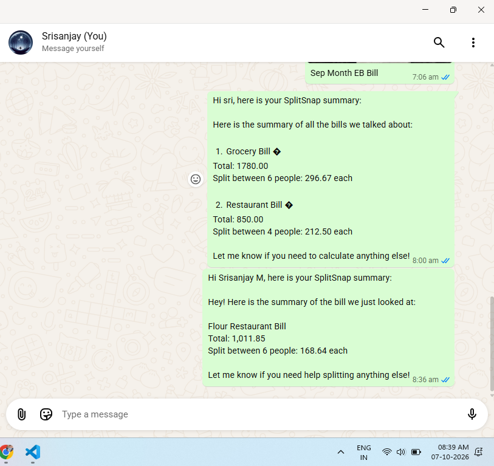

 # 🧾 SplitSnap

**Snap your bill. Split it in seconds.**

An AI chatbot that reads a bill or receipt from a photo or a text description, works out the total, and splits it between friends — then turns the whole conversation into a WhatsApp-ready summary.

🔗 **Live app:** https://macrosnap-sri.streamlit.app

> The live demo runs on a free Gemini API quota. If it stops responding, the daily quota may be used up — try again later. The app may also go to sleep after inactivity; click "get this app back up" if so.

## Screenshots

| Onboarding | Chat | WhatsApp summary |
|---|---|---|
|  |  |  |

## Features

- Send a bill/receipt photo or type the amount, and get the items, total, and a per-person split
- Chat with memory, so follow-ups like "split it between 4 instead" work
- Stays on topic: bills, receipts, and expenses only
- One click builds a summary of every bill in the conversation and opens it in WhatsApp
- Retries automatically when the Gemini API is busy or returns an empty reply
- Phone number validation on the onboarding form
- Custom dark UI with an animated background, built with CSS on top of Streamlit

## Tech stack

- **Python** and **Streamlit** for the app
- **Google Gemini** for image understanding and chat
- **WhatsApp click-to-chat (wa.me)** to deliver the summary
- **Streamlit Community Cloud** for deployment

## How it works

Photo or text of a bill → Streamlit → Gemini → split calculated → WhatsApp

## Run locally

```bash
git clone https://github.com/srisanjay-sj/macrosnap.git
cd macrosnap
python -m venv venv
venv\Scripts\activate
pip install -r requirements.txt
streamlit run app.py
```

Copy `.streamlit/secrets.toml.example` to `.streamlit/secrets.toml` and fill in your own Gemini API key. This file is git-ignored and never committed.

## Credits

Built by Srisanjay M as part of an NxtWave "Build Your Own AI Vision Chatbot" workshop. The workshop's shared demo project was MacroSnap, a meal-calorie chatbot; this submission reworks the same Gemini + Streamlit pattern into SplitSnap, a bill-splitting assistant, with my own additions: error and empty-reply retry, phone validation, the wa.me delivery flow (the original used Twilio, which my trial account could not send from), and a redesigned UI.